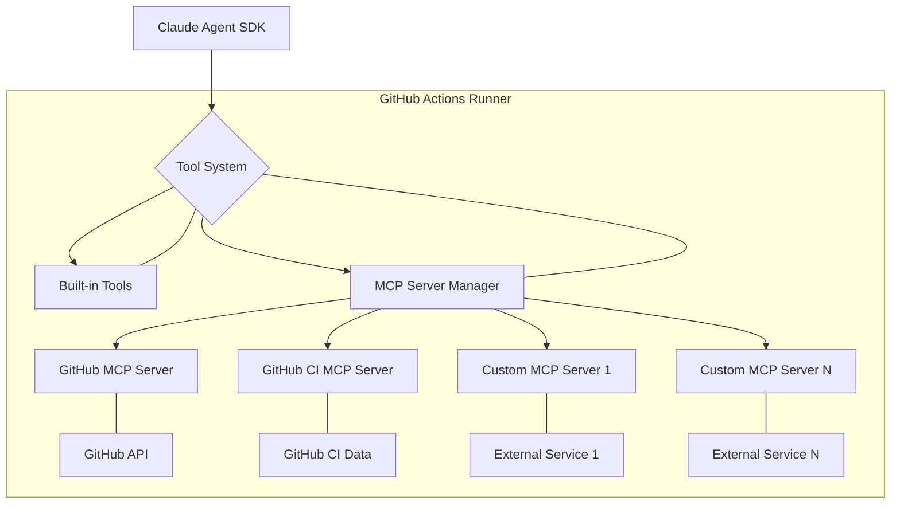

# Advanced Tool Management

Claude Code GitHub Actions empowers the AI agent with a suite of tools to interact with your repository and external systems. This document details how to manage these tools, including granting permissions, restricting access, and integrating custom tools via the Model Context Protocol (MCP).

## 1. Understanding Tool Access

By default, Claude Code has access to a set of "safe" tools for reading and navigating your codebase. However, for actions that modify the repository or interact with external services, explicit permission must be granted.

### Default Tools (Always Available)

The following tools are generally available to Claude for basic operations:

*   **Read**: Read the content of files.
*   **View**: View file contents (similar to `Read`).
*   **GlobTool**: Find files matching specific patterns.
*   **GrepTool**: Search for patterns within file contents.
*   **Edit**: Modify the content of files.
*   **Replace**: Perform find-and-replace operations within files.
*   **GitLog**: View Git commit history.
*   **GitDiff**: Generate Git diffs between versions.
*   **mcp__github__***: A set of tools provided by the built-in GitHub MCP Server for interacting with GitHub's API (e.g., creating PRs, issues, comments).

**Important**: Claude **does not** have arbitrary `Bash` command execution privileges by default. Any shell command (e.g., `npm install`, `pytest`) must be explicitly allowed.

## 2. Granting and Restricting Tool Permissions

You control Claude's access to tools using the `allowed_tools` and `disallowed_tools` parameters within your workflow configuration. These parameters accept a comma-separated list of tool names or patterns.

### `allowed_tools`

This parameter specifies which tools Claude is permitted to use. If `allowed_tools` is provided, only the listed tools (and any implicitly allowed default tools) will be available.

*   **Syntax**: `ToolName`, `ToolName(arg)`, `ToolName(*)`
*   **Example**: `allowed_tools: "Read,Edit,Bash(npm install),Bash(npm test:*)"`

#### Allowing Specific Bash Commands

To allow Claude to execute shell commands, you must explicitly grant `Bash` tool access, optionally specifying the exact commands or patterns.

*   `Bash(command)`: Allows a specific command without arguments.
*   `Bash(command:*)`: Allows a specific command with any arguments.
*   `Bash(*)`: Allows any bash command (use with extreme caution).

**Example**: Allowing `npm install` and any `git push` command:

```yaml
claude_args: "--allowed-tools Bash(npm install),Bash(git push:*)"
```

### `disallowed_tools`

This parameter specifies tools that Claude is explicitly forbidden from using. This is useful for overriding default tool access or for fine-tuning permissions when `allowed_tools` is broadly defined.

*   **Syntax**: `ToolName`, `ToolName(arg)`, `ToolName(*)`
*   **Example**: `disallowed_tools: "WebFetch,KillTask"`

### Configuration Examples

#### 1. Read-Only Analysis (Safe Mode)

Allows Claude to analyze code without making any modifications or executing external commands.

```yaml
- uses: anthropics/claude-code-action @v1
  with:
    anthropic_api_key: ${{ secrets.ANTHROPIC_API_KEY }}
    claude_args: "--allowed-tools Read,View,GrepTool,GitLog,GitDiff --disallowed-tools Edit,Replace,Bash,WebFetch"
```

#### 2. Code Review with Limited Modification

Allows Claude to read code and post review comments, but not to directly edit files or run arbitrary shell commands.

```yaml
- uses: anthropics/claude-code-action @v1
  with:
    anthropic_api_key: ${{ secrets.ANTHROPIC_API_KEY }}
    claude_args: "--allowed-tools Read,View,GrepTool,mcp__github__create_pull_request_review --disallowed-tools Edit,Replace,Bash"
```

#### 3. Full Automation with Testing Capabilities

Grants Claude broad access, including the ability to run tests and modify files. Use with strong security considerations.

```yaml
- uses: anthropics/claude-code-action @v1
  with:
    anthropic_api_key: ${{ secrets.ANTHROPIC_API_KEY }}
    claude_args: "--allowed-tools Bash(*),Edit,Replace,WebFetch,mcp__github__* --max-turns 20"
```

## 3. Model Context Protocol (MCP) Servers

The Model Context Protocol (MCP) is an open standard that allows Claude to integrate with external tools and data sources beyond its built-in capabilities. MCP servers expose specific functionalities as tools that Claude can then utilize.

### Built-in MCP Servers

Claude Code GitHub Actions includes two essential built-in MCP servers:

1.  **GitHub MCP Server**: Provides tools for direct interaction with GitHub's API.
    *   **Tools**: `create_or_update_file`, `push_files`, `create_pull_request`, `create_issue`, `add_issue_comment`, `fork_repository`, etc.
    *   **Configuration**: Automatically enabled. Requires `GITHUB_TOKEN` (or a custom GitHub App token) with appropriate permissions.

2.  **GitHub CI MCP Server**: Offers tools to access CI/CD related information.
    *   **Tools**: `get_ci_status`, `get_workflow_run_details`, `download_job_log`.
    *   **Permissions**: Requires `actions: read` permission in your workflow.

### Adding Custom MCP Servers

You can extend Claude's capabilities by defining and integrating your own custom MCP servers. These servers can be configured directly within your workflow using the `mcp_config` parameter.

#### `mcp_config` Parameter

The `mcp_config` parameter accepts a JSON string defining your MCP servers.

**Example Structure**:

```yaml
claude_args: |
  --mcp-config '{
    "mcpServers": {
      "my-custom-server": {
        "command": "npx",
        "args": ["-y", "@my-org/mcp-server-package"],
        "env": {
          "API_KEY": "${{ secrets.CUSTOM_API_KEY }}"
        }
      }
    }
  }'
```

**Key Properties**:

*   `mcpServers`: An object where keys are unique server names (e.g., `my-custom-server`).
*   `command`: The executable command to start the MCP server (e.g., `npx`, `python`).
*   `args`: An array of arguments to pass to the command.
*   `env`: An object of environment variables to set for the MCP server process.

#### Loading MCP from `.mcp.json`

If a `.mcp.json` file exists in the root of your repository, Claude Code will automatically load its definitions. This allows for repository-level MCP server configuration.

**Example `.mcp.json`**:

```json
{
  "mcpServers": {
    "project-db": {
      "command": "npx",
      "args": ["-y", "@example/database-mcp"],
      "env": {
        "DB_URL": "postgresql://localhost:5432/mydb"
      }
    }
  }
}
```

**Important**: Even if MCP servers are defined in `mcp_config` or `.mcp.json`, their tools still require explicit permission via `allowed_tools` (e.g., `mcp__my-custom-server__*`).

### Conceptual Diagram: MCP Server Integration



## 4. Security Considerations for MCP

*   **Secrets Management**: Always use GitHub Secrets for any sensitive information (API keys, database credentials) passed to MCP servers via environment variables.
*   **Least Privilege**: Grant only the minimum necessary tools to Claude. Be cautious with `Bash(*)` or broad `mcp__*__*` permissions.
*   **Tool Whitelisting**: Explicitly list `allowed_tools` to prevent unintended access.
*   **Review Custom Servers**: Thoroughly review the code and capabilities of any custom MCP server you integrate.
