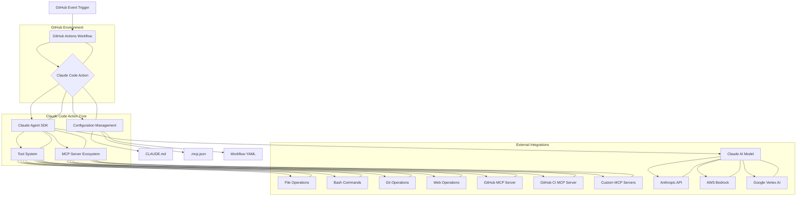
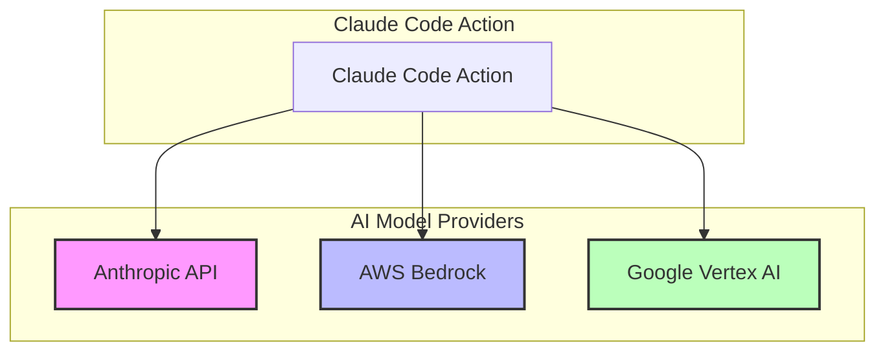

# Architecture Overview

Claude Code GitHub Actions is built on a robust, layered architecture designed for extensibility, security, and efficient AI-powered automation within GitHub workflows.

## 1. System Architecture

The system operates by integrating several key components that work in concert to provide AI capabilities directly within your GitHub repository.

**Explanation of Flow:**

1.  **GitHub Event Trigger**: Any configured GitHub event (e.g., `issue_comment`, `pull_request`, `schedule`) initiates a workflow run.
2.  **GitHub Actions Workflow**: The workflow defines the steps, permissions, and environment for the Claude Code Action.
3.  **Claude Code Action**: The core action orchestrates the interaction between GitHub, the Claude Agent, and various tools.
4.  **Claude Agent SDK**: This programmatic interface manages the AI model's interaction, context, and decision-making process.
5.  **Tool System**: Provides the Claude Agent with capabilities to interact with the repository and external systems (e.g., file system, Git, shell).
6.  **MCP Server Ecosystem**: Extends the tool system by allowing integration with specialized external services and data sources via the Model Context Protocol.
7.  **Configuration Management**: Guides Claude's behavior through project-specific rules (`CLAUDE.md`), MCP server definitions (`.mcp.json`), and workflow parameters.
8.  **Claude AI Model**: The underlying AI model (Anthropic, Bedrock, or Vertex AI) processes prompts and generates responses.

## 2. Key Components

### 2.1 GitHub Action Core

This component serves as the orchestrator within the GitHub Actions environment. It handles:

*   **Event Listening**: Reacts to specified GitHub events (e.g., comments, PRs, issues).
*   **Workflow Execution**: Manages the lifecycle of the Claude Code session, including setup, execution, and result reporting.
*   **GitHub API Interaction**: Utilizes GitHub tokens and permissions to interact with repository resources (e.g., creating comments, opening PRs, modifying files).

### 2.2 Claude Agent SDK

The Claude Agent SDK is the brain of the operation, providing the programmatic interface for AI interaction. Its responsibilities include:

*   **Model Interaction**: Communicates with the chosen Claude AI model.
*   **Context Management**: Maintains conversational context and automatically compresses information to stay within token limits.
*   **Decision Making**: Interprets instructions, selects appropriate tools, and formulates responses or actions.
*   **Permission Enforcement**: Ensures that the agent only uses tools and performs actions within its granted permissions.

### 2.3 MCP Server Ecosystem

The Model Context Protocol (MCP) is an open standard that enables the AI agent to integrate with external tools and data sources. This ecosystem includes:

*   **GitHub MCP Server**: Provides tools for direct interaction with GitHub's API, such as creating/updating files, pushing changes, creating pull requests, and managing issues/comments.
*   **GitHub CI MCP Server**: Offers tools to access CI/CD-related information, including workflow run statuses, job details, and log retrieval.
*   **Custom MCP Servers**: Allows developers to extend Claude's capabilities by integrating any third-party service or internal tool via a standardized protocol.

### 2.4 Tool System

The Tool System equips the Claude Agent with the means to perform actions within the repository and beyond. It encompasses:

*   **File Operations**: Tools for reading, writing, editing, searching (grep), and listing (glob) files.
*   **Code Execution**: Capabilities to execute shell commands (e.g., `bash`, `npm`, `poetry`), enabling tasks like running tests or installing dependencies.
*   **Git Operations**: Tools for interacting with the Git repository, such as viewing logs, diffs, committing changes, and pushing to branches.
*   **Web Operations**: Functionality to fetch content from URLs, allowing the agent to gather information from the web.

### 2.5 Configuration Management

This layer defines how Claude's behavior is customized and controlled:

*   **`CLAUDE.md`**: A markdown file placed at the repository root that defines project-specific guidelines, coding standards, review criteria, and preferred patterns. Claude uses this file to understand and adhere to your project's conventions.
*   **`.mcp.json`**: A JSON file for defining and configuring custom MCP servers at the repository level.
*   **Workflow YAML**: The GitHub Actions workflow file itself, where parameters like `prompt`, `claude_args`, `allowed_tools`, and `settings` are defined to control the action's execution.

## 3. Deployment Models

Claude Code GitHub Actions supports various deployment models to suit different organizational needs and security requirements.

### 3.1 Direct Anthropic API (Default)

*   **Description**: This is the default and simplest deployment model, where the Claude Code Action directly communicates with Anthropic's API endpoints.
*   **Authentication**: Requires an `ANTHROPIC_API_KEY` secret.
*   **Use Case**: Ideal for individual developers, small teams, or projects where direct API access is preferred for ease of setup.

### 3.2 AWS Bedrock

*   **Description**: For enterprise environments requiring greater control over data residency and billing, Claude Code can integrate with Amazon Bedrock. This means the Claude AI models run within your AWS infrastructure.
*   **Authentication**: Leverages OpenID Connect (OIDC) for secure authentication from GitHub Actions to AWS, eliminating the need for long-lived static credentials.
*   **Model Format**: Model IDs typically include a region prefix and version suffix (e.g., `us.anthropic.claude-sonnet-4-5-20250929-v1:0`).
*   **Use Case**: Organizations with existing AWS infrastructure, strict compliance requirements, or a need for unified billing and management within AWS.

### 3.3 Google Vertex AI

*   **Description**: Similar to AWS Bedrock, this model allows Claude Code to utilize Google Cloud Vertex AI for hosting Claude models. This provides enterprise-grade security and compliance within the Google Cloud ecosystem.
*   **Authentication**: Uses Workload Identity Federation for secure, credential-less authentication between GitHub Actions and Google Cloud.
*   **Model Format**: Model IDs often include a date suffix (e.g., `claude-sonnet-4 @20250514`).
*   **Use Case**: Enterprises operating within Google Cloud, seeking enhanced security, data residency controls, and integrated AI services.
