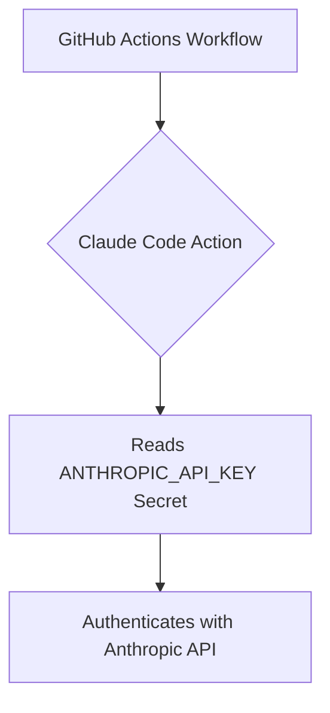
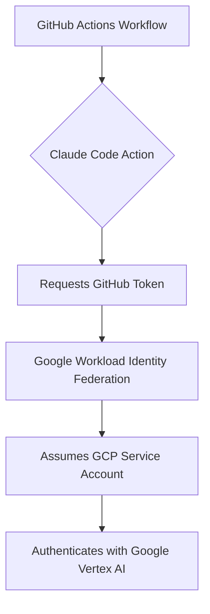
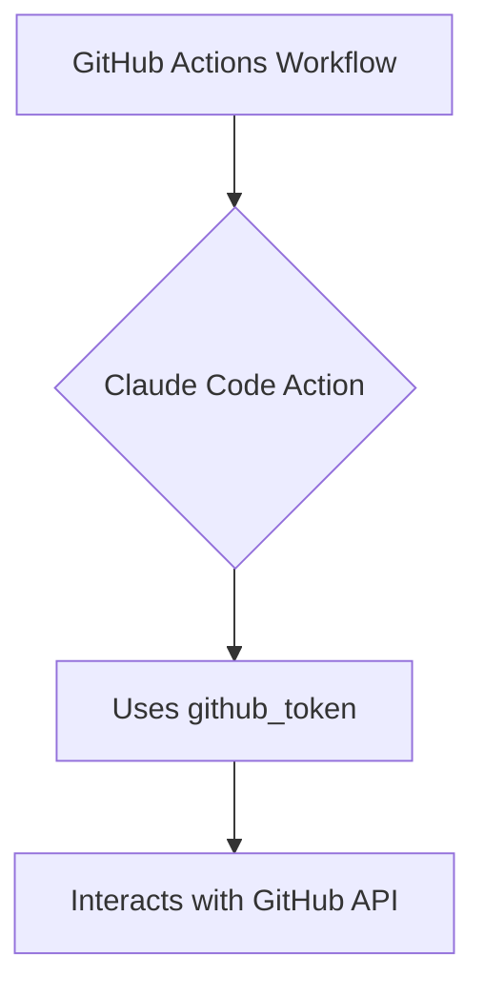

# Security and Authentication

Security is paramount when integrating AI into your development workflows. Claude Code GitHub Actions provides robust mechanisms for authentication, authorization, and secure operation. This document outlines best practices and configurations to ensure your workflows are secure.

## 1. Authentication Methods

Claude Code GitHub Actions supports various authentication methods for interacting with the Claude API and GitHub.

### 1.1 Direct Anthropic API

This is the default method, connecting directly to Anthropic's API.

*   **Mechanism**: Requires an API key obtained from the Anthropic Console.
*   **Configuration**: The API key is passed as a GitHub secret.



### 1.2 AWS Bedrock (OIDC)

For enterprise environments, Claude Code can leverage AWS Bedrock, authenticating via OpenID Connect (OIDC).

*   **Mechanism**: GitHub Actions assumes an AWS IAM Role using OIDC, providing temporary credentials. This eliminates the need to store long-lived AWS access keys in GitHub.
*   **Configuration**: Requires an IAM role with a trust policy allowing GitHub's OIDC provider, and the role ARN passed as a secret (`AWS_ROLE_TO_ASSUME`).

```mermaid
graph TD
    A[GitHub Actions Workflow] --> B{Claude Code Action}
    B --> C[Requests OIDC Token]
    C --> D[GitHub OIDC Provider]
    D --> E[AWS STS]
    E --> F[Assumes IAM Role (AWS_ROLE_TO_ASSUME)]
    F --> G[Authenticates with AWS Bedrock]
```

### 1.3 Google Vertex AI (Workload Identity Federation)

Integration with Google Vertex AI uses Workload Identity Federation for secure authentication.

*   **Mechanism**: GitHub Actions exchanges a GitHub-issued token for a Google Cloud short-lived access token, allowing it to impersonate a GCP service account.
*   **Configuration**: Requires a Workload Identity Pool and Provider setup in GCP, and the provider resource name (`GCP_WORKLOAD_IDENTITY_PROVIDER`) and service account email (`GCP_SERVICE_ACCOUNT`) passed as secrets.



### 1.4 GitHub Token

Claude Code GitHub Actions interacts with the GitHub API (e.g., to read/write files, create PRs/issues).

*   **Mechanism**: Uses a GitHub Token to authenticate API requests.
*   **Configuration**:
    *   **Default**: `GITHUB_TOKEN` (automatically provided by GitHub Actions with limited permissions).
    *   **Custom GitHub App**: For more granular control or specific use cases, a custom GitHub App can be used to generate a token with tailored permissions. This is recommended for 3rd party cloud provider integrations.



## 2. Secure Credential Management

**CRITICAL**: Never hardcode API keys or sensitive credentials directly into your workflow files. Always use GitHub Secrets.

### Best Practices for Secrets

*   **Use GitHub Secrets**: Store all sensitive information (API keys, cloud credentials, custom MCP server secrets) as encrypted GitHub Secrets.
*   **Reference Secrets**: Access secrets in your workflow using the `${{ secrets.SECRET_NAME }}` syntax.
*   **Least Privilege**: Ensure that secrets are only accessible to the workflows and environments that strictly require them.

## 3. Permissions and Access Control

Controlling what Claude can do is essential for security. This is managed at multiple levels:

### 3.1 GitHub Workflow Permissions

The `permissions` block in your workflow YAML defines the scope of the `GITHUB_TOKEN` and other tokens generated within the workflow.

*   **Minimum Required Permissions**:
    ```yaml
    permissions:
      contents: write       # For modifying repository files
      pull-requests: write  # For creating/updating PRs
      issues: write         # For creating/updating issues/comments
    ```
*   **Additional Permissions (as needed)**:
    *   `actions: read`: Required for the GitHub CI MCP Server to access workflow run details and logs.
    *   `id-token: write`: Essential for OIDC-based authentication with AWS Bedrock and Google Vertex AI.

### 3.2 Tool Permissions (`allowed_tools`, `disallowed_tools`)

These parameters in `claude_args` control which specific tools the Claude Agent can execute.

*   **`allowed_tools`**: Explicitly whitelist tools. If specified, only these tools are available.
*   **`disallowed_tools`**: Blacklist tools. Prevents Claude from using specified tools.
*   **`Bash` Tool**: Arbitrary shell command execution (`Bash(*)`) should be used with extreme caution and only when absolutely necessary. Prefer `Bash(specific command)` or `Bash(command:*)`.

### 3.3 MCP Server Permissions

Tools exposed by MCP servers (both built-in and custom) are also subject to the `allowed_tools` and `disallowed_tools` configurations. Additionally, MCP servers themselves might require specific environment variables (often secrets) to function.

## 4. Commit Signing and Traceability

All commits made by Claude Code GitHub Actions are automatically signed with commit signatures.

*   **Authenticity**: Provides cryptographic proof of the commit's origin, enhancing trust and traceability.
*   **Auditability**: Helps in auditing changes made by automated agents.
*   **Co-authored-by**: You can configure Claude to include `Co-authored-by` trailers in commits, attributing changes to the AI agent.

### Conceptual Diagram: Security Layers

```mermaid
graph TD
    A[GitHub Actions Workflow] --> B{GitHub Token Permissions}
    B --> C{Claude Code Action}
    C --> D{Tool Access Control (allowed_tools/disallowed_tools)}
    D --> E[Claude Agent SDK]
    E --> F[MCP Server Permissions]
    F --> G[External Services / Repository]

    subgraph Credential Management
        H[GitHub Secrets]
        I[OIDC / Workload Identity Federation]
    end

    H --> C
    I --> C
```

## 5. Security Best Practices

*   **Principle of Least Privilege**: Grant only the minimum necessary permissions to your GitHub workflows and Claude's tools.
*   **Regular Audits**: Periodically review workflow configurations, granted permissions, and Claude's activities.
*   **Branch Protection Rules**: Implement branch protection rules requiring reviews for PRs created by automated agents.
*   **`CLAUDE.md` for Guidelines**: Use `CLAUDE.md` to define security-related coding standards and review criteria for Claude to follow.
*   **Review Claude's Output**: Always review Claude's suggestions and generated code before merging.
*   **Avoid Arbitrary Code Execution**: Be extremely cautious with `Bash(*)` and ensure any custom MCP servers are thoroughly vetted.
